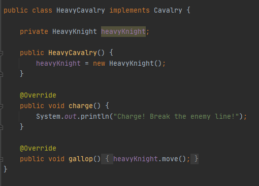
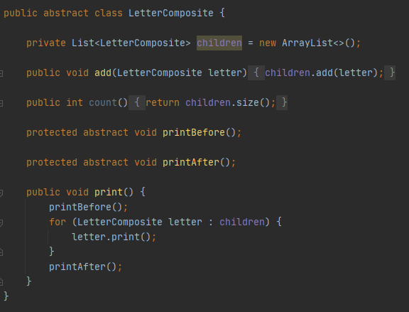
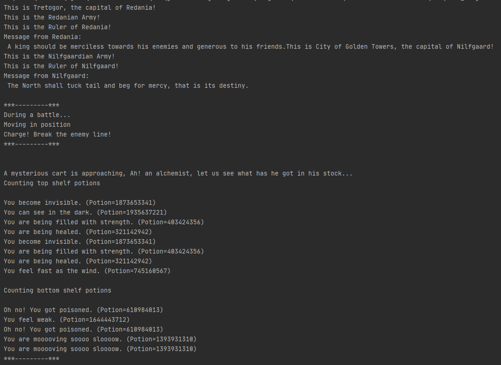

# GrotesqueChinchilla-tmps
## Design Patterns implementation laboratory works
### Author: Constantin Cazacu 

### Objectives
* Get familiar with the Structural Design Patterns;
* Implement at least 3 Structural Design Patterns for the specific domain;

### Implemented Patterns:
* Adapter
* Composite
* Flyweight

**Adapter**
Match interfaces of different classes

***Intent***

* Adapter is a structural design pattern that allows objects with incompatible interfaces to collaborate.
* Convert the interface of a class into another interface clients expect. Adapter lets classes work together that couldn't otherwise because of incompatible interfaces.
* Wrap an existing class with a new interface.

**Composite**
A tree structure of simple and composite objects

***Intent***

* Compose objects into tree structures to represent whole-part hierarchies. Composite lets clients treat individual objects and compositions of objects uniformly.
* Recursive composition

**Flyweight**
A fine-grained instance used for efficient sharing

***Intent***

* Use sharing to support large numbers of fine-grained objects efficiently.
* Each “flyweight” object is divided into two parts:
  * Extrinsic: state dependent part.
  * Intrinsic: state independent part.
  
### Implementation
The **Adapter** `HeavyCavalry` converts interface of the adaptee class `HeavyKnight` into a suitable one expected by the client `Cavalry`.
For this case the `HeavyKnight` is repurposed adding the characteristics of the `Cavarly` unit which can `charge` and `gallop`.


The **Composite** pattern is used for establishing communications between kingdom rulers, Redania and Nilfgaard in this case by introducing `LetterComposite` abstraction.
In this case `letters` compose `words`, and `words` compose `sentences`.


**Flyweight** pattern is useful when the program needs a huge amount of objects. It provides means to decrease resource usage by sharing object instances.
In this example `WonderingAlchemistTrader` has great amount of potions on its shelves. To fill the shelves `WonderingAlchemistTrader` uses `Potion Factory` (which represents the Flyweight in this example). Internally `Potion Factory` holds a map of the potions and lazily creates new ones when requested.
```java
public class PotionFactory {

    private final Map<PotionType, Potion> potions;

    public PotionFactory() {
        potions = new EnumMap<>(PotionType.class);
    }

    Potion createPotion(PotionType type) {
        Potion potion = potions.get(type);
        if (potion == null) {
            switch (type) {
                case HEALING:
                    potion = new HealingPotion();
                    potions.put(type, potion);
                    break;
                case INVISIBILITY:
                    potion = new InvisibilityPotion();
                    potions.put(type, potion);
                    break;
                case NIGHT_VISION:
                    potion = new NightVisionPotion();
                    potions.put(type, potion);
                    break;
                case POISON:
                    potion = new PoisonPotion();
                    potions.put(type, potion);
                    break;
                case SLOWNESS:
                    potion = new SlownessPotion();
                    potions.put(type, potion);
                    break;
                case STRENGTH:
                    potion = new StrengthPotion();
                    potions.put(type, potion);
                    break;
                case SWIFTNESS:
                    potion = new SwiftnessPotion();
                    potions.put(type, potion);
                    break;
                case WEAKNESS:
                    potion = new WeaknessPotion();
                    potions.put(type, potion);
                    break;
                default:
                    break;
            }
        }
        return potion;
    }
}
```
### Conclusion
Structural patterns explain how to assemble objects and classes into larger structures while keeping these structures flexible and efficient.
The benefit of this type of pattern is that it simplifies the process of realizing relationships between entities.
 