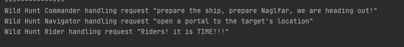

# GrotesqueChinchilla-tmps
## Design Patterns implementation laboratory works
### Author: Constantin Cazacu 

### Objectives
* Get familiar with the Behavioral Design Patterns;
* Implement at least 1 Behavioral Design Pattern(s) for the specific domain;

### Implemented Pattern(s):
* Chain of Responsibility

**Chain of Responsibility**
A way of passing a request between a chain of objects

***Intent***

* Avoid coupling the sender of a request to its receiver by giving more than one object a chance to handle the request. Chain the receiving objects and pass the request along the chain until an object handles it.
* Launch-and-leave requests with a single processing pipeline that contains many possible handlers.
* An object-oriented linked list with recursive traversal.

### Implementation
In this example we organize the request handlers `RequestHandler` into a chain where each
handler has a chance to act on the request on its turn. Here the king `KingOfTheWildHunt` makes
requests and the military ranks `WildHuntCommander`, `WildHUntOfficer`, `WildHuntSoldier`
form the handler chain.
```java
public abstract class RequestHandler {

    private RequestHandler next;

    public RequestHandler(RequestHandler next) {
        this.next = next;
    }

//    request handler

    public void handleRequest(Request req) {
        if (next != null) {
            next.handleRequest(req);
        }
    }

    protected void printHandling(Request req) {
        System.out.println(this + " handling request \"" + req + "\"");
    }

    @Override
    public abstract String toString();
}
```
### Conclusion
In software engineering, behavioral design patterns are design patterns that identify
common communication patterns between objects and realize these patterns. By doing so,
these patterns increase flexibility in carrying out this communication.
Chain of Responsibility addresses how you can decouple senders and receivers, but with
different trade-offs. Chain of responsibility for instance, passes a sender request along
a chain of potential receivers. 
 


