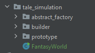
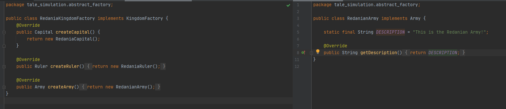
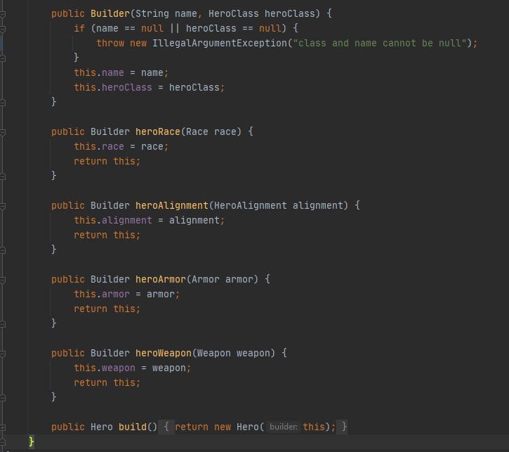
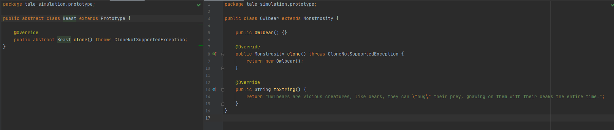
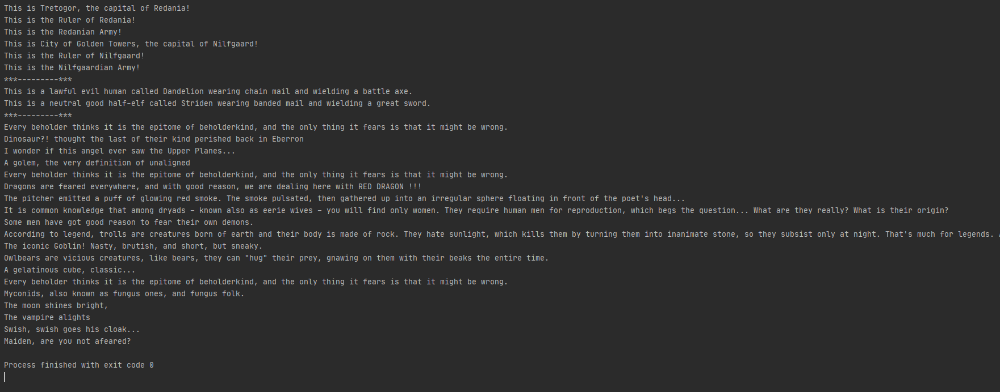

# GrotesqueChinchilla-tmps
## Design Patterns implementation laboratory works
### Author: Constantin Cazacu 

### Objectives
* Get familiar with the Creational Design Patterns;
* Choose a specific domain;
* Implement at least 3 Creational Design Patterns for the specific domain;

### Implemented Patterns:
* Abstract Factory
* Builder
* Prototype

**Abstract Factory**
Creates an instance of several families of classes

***Intent***

* Provide an interface for creating families of related or dependent objects without specifying their concrete classes.
* A hierarchy that encapsulates: many possible "platforms", and the construction of a suite of "products".
* The `new` operator is considered harmful.

**Builder**
Separates object construction from its representation

***Intent***
* Separate the construction of a complex object from its representation so that the same construction process can create different representations.
* Parse a complex representation, create one of several targets.

**Prototype**
A fully initialized instance to be copied or cloned

***Intent***
* Specify the kinds of objects to create using a prototypical instance, and create new objects by copying this prototype.
* Co-opt one instance of a class for use as a breeder of all future instances.
* The `new` operator is considered harmful.

### Implementation
As a reference this is a fantasy world inspired by D&D and the Witcher universes.

The project is divided in 3 packages that implement each type of design pattern and the main file.

The **Abstract Factory** implements the concept of the kingdom creation, which have their own elements such as Army, Capital and Ruler. Each class implements an interface, which are used in creating the `KingdomFactory` - an abstract factory that makes a family of related objects.

The **Builder** creates the characters or heroes of the story. It was build a static nested class `Hero` with the builder class created in it. The builder class has a public constructor with all the required attributes.

The **Prototype** populates the world with other monsters and creatures. It declares the interface for cloning itself.

### Conclusion
The creational patterns aim to separate a system from how its objects are created, composed, and represented. They increase the system's flexibility in terms of the what, who, how, and when of object creation.
This can be seen in the output. For each pattern there were created several objects which stick to the ida and its implementation.

